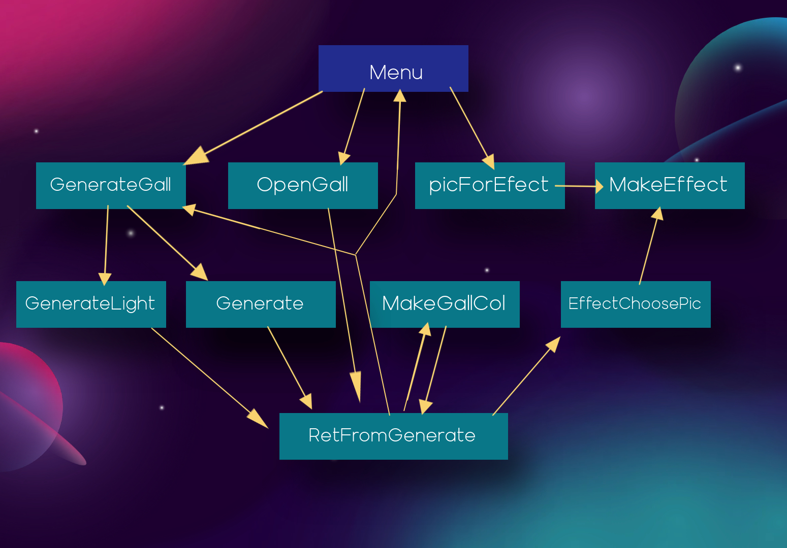
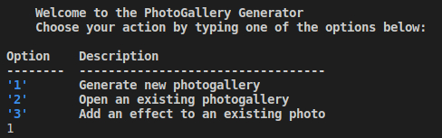
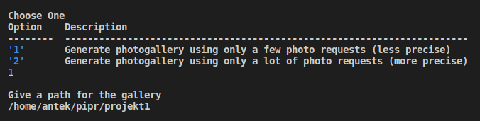
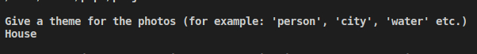
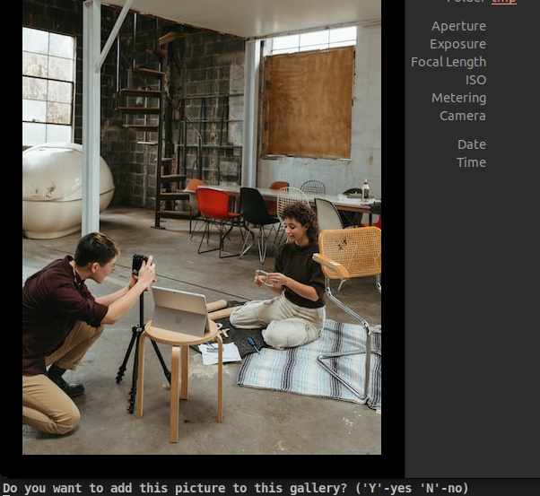
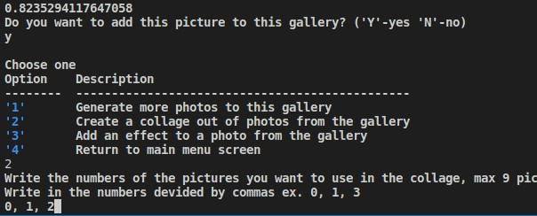
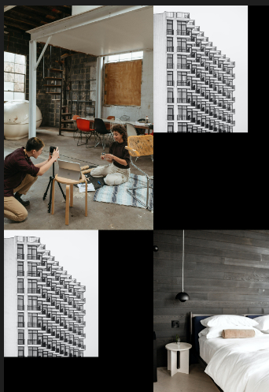
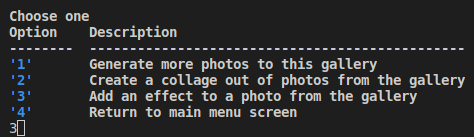
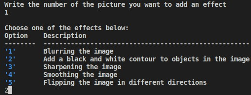

# Projekt1

## Name
Generator fotogalerii

## Description
Program generuje fotogalerie o temacie zadanym przez użytkownika. Dodatkowo może on tworzyć kolaż ze zdjęć z fotogalerii oraz nakładać 5 różnych effektów na zdjęcia.

## Visuals
Plan przejść przez ekrany interfejsu:
    

## Installation
Aby włączyć należy odpalić poprostu plik o nazwie main.py. Trzeba mieć wcześniej zainstalowane te biblioteki: tabulate, colorama, pillow, i ntlk (reszta to podstawowe) Poniżej pokazane krok po kroku odpalenie programu.

## Usage
Tutaj podaje przykład stworzenia forogalerii w krokach i później zrobienia z niej kolaż zdjęć, oraz położenia efektu na zdjęcie:

1. 
2. 
3. 
4. 
5. 
6. 
7. 
8. 
9. 

## Support
Tell people where they can go to for help. It can be any combination of an issue tracker, a chat room, an email address, etc.

## Roadmap
If you have ideas for releases in the future, it is a good idea to list them in the README.

## Contributing
State if you are open to contributions and what your requirements are for accepting them.

For people who want to make changes to your project, it's helpful to have some documentation on how to get started. Perhaps there is a script that they should run or some environment variables that they need to set. Make these steps explicit. These instructions could also be useful to your future self.

You can also document commands to lint the code or run tests. These steps help to ensure high code quality and reduce the likelihood that the changes inadvertently break something. Having instructions for running tests is especially helpful if it requires external setup, such as starting a Selenium server for testing in a browser.

## Authors and acknowledgment
Show your appreciation to those who have contributed to the project.

## License
For open source projects, say how it is licensed.

## Project status
If you have run out of energy or time for your project, put a note at the top of the README saying that development has slowed down or stopped completely. Someone may choose to fork your project or volunteer to step in as a maintainer or owner, allowing your project to keep going. You can also make an explicit request for maintainers.
