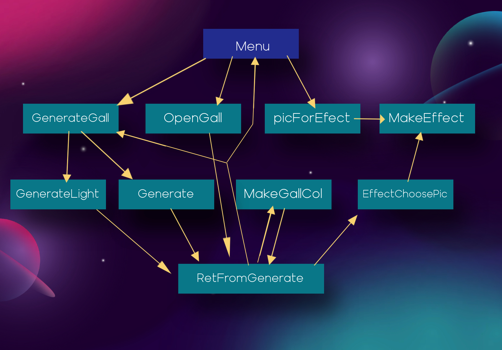
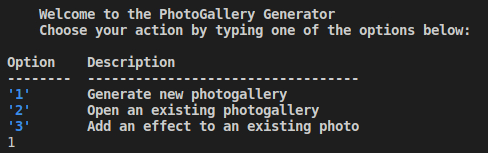
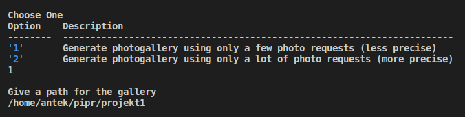
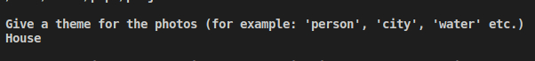
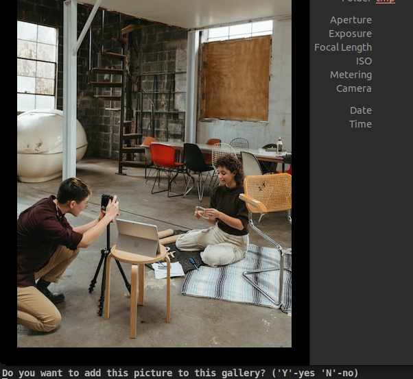
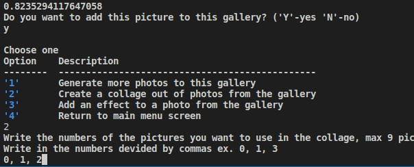
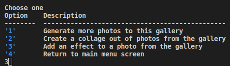
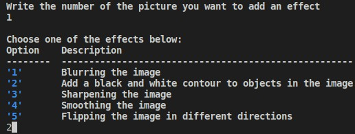
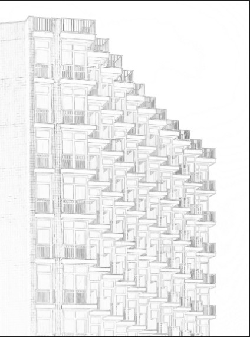

# Projekt1

## Name
Generator fotogalerii

## Description
Program generuje fotogalerie o temacie zadanym przez użytkownika. Dodatkowo może on tworzyć kolaż ze zdjęć z fotogalerii oraz nakładać 5 różnych effektów na zdjęcia.

## Visuals
Plan przejść przez ekrany interfejsu:
    

## Installation
Aby włączyć należy odpalić poprostu plik o nazwie main.py. Trzeba mieć wcześniej zainstalowane te biblioteki: tabulate, colorama, pillow, i ntlk (reszta to podstawowe) Poniżej pokazane krok po kroku odpalenie programu.

## Usage
Tutaj podaje przykład stworzenia forogalerii w krokach i później zrobienia z niej kolaż zdjęć, oraz położenia efektu na zdjęcie (Po najechaniu myszką na zdjęcie, pojawia się opis):

1. 
2. W tym kroku istotne jest aby wybrać pierwszą opcję do generowania galerii, ponieważ ta druga często zużywa wszystkie requesty i nie można dalej korzystać z programu. Jest ona jedynia przezemnie zostawiona w przypadku posiadania ulepszonego konta.

3. 
4. 
5. 
6. 
7. 
8. 
9. 
